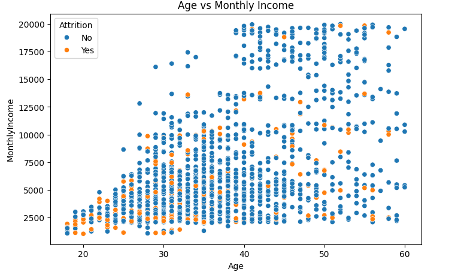
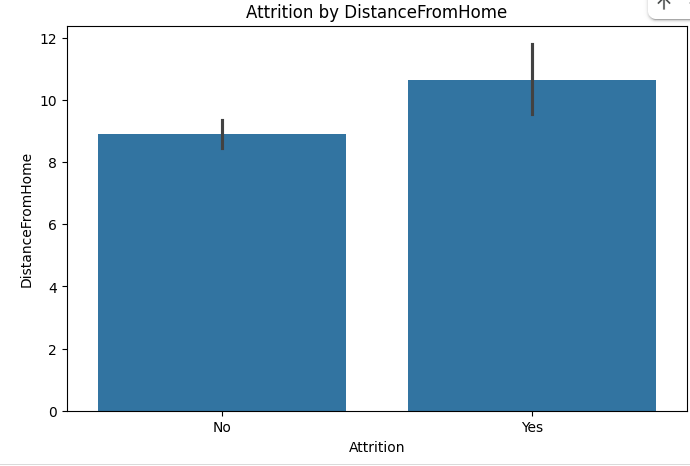
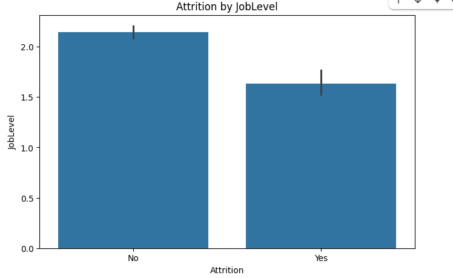
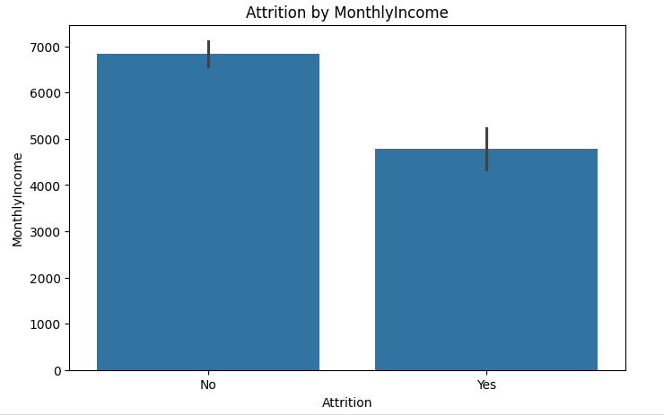
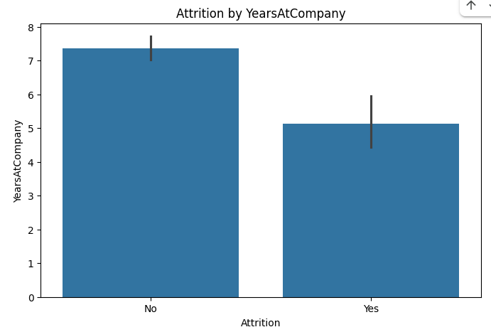
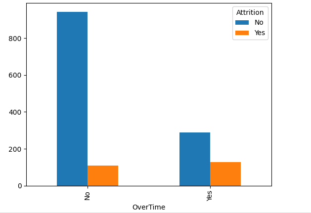

# EmployeeAttritionAnalysis
## Table of Contents
  - [Project Overview](#project-overview)
  - [Data Sources](#data-sources)
  - [Tools](#tools)
  - [Data Cleaning](#data-cleaning)
  - [Exploratory Data Analysis](#exploratory-data-analysis)
  - [Results and Findings](#results-and-findings)
  - [Recommendations](#recommendations)
### Project Overview
In this project,we were tasked by a company to explain why there was a growing reduction in its workforce. To address this, the analysis focused on key factors that could drive employees to leave, including low pay, excessive workload leading to poor work-life balance, age-related trends, and department-specific attrition rates.
The study explored critical areas to uncover patterns and insights:
   - **Attrition vs. Distance From Home** – To determine if long commutes contributed to employee departures.
   - **Attrition vs. Department** – To identify which departments experienced the highest turnover.
   - **Attrition vs. Marital Status** – To assess whether single, married, or divorced employees were more likely to leave.
   - **Attrition vs. Business Travel** – To evaluate if frequent travel increased the likelihood of attrition.
     
By analyzing these factors, the company aimed to gain data-driven insights that would help improve retention strategies, reduce unnecessary turnover, and create a more stable workforce.
### Data Sources
Downloaded the employee-attrition.csv from [Kaggle](https://www.kaggle.com/datasets) using kaggle-api.
Here are the steps to download the data set:
  - Go to [Kaggle](https://www.kaggle.com/) and log in.
  - Click on your profile picture (top right) → Account.
  - Scroll down to the API section and click "Create New API Token".
  - A file named kaggle.json will be downloaded. This file contains your API credentials.
  - Upload the downloaded kaggle.json into your google colab

Then run the following lines of code in your google colab cell
```
  !pip install kaggle
  !mkdir -p ~/.kaggle
  !mv kaggle.json ~/.kaggle/
  !chmod 600 ~/.kaggle/kaggle.json
  !kaggle datasets download -d username/dataset-name
```
### Tools
  - Python
  - Pandas
  - Matplotlib
  - Seaborn
  - Tableau
### Data Cleaning
Upon inspecting the dataset, no missing values or duplicate records were found. This ensured that no additional imputation or data deduplication was necessary, allowing for a smooth data analysis process.
Here is the Python code which confirmed this:
```
  # Check for missing values
  print(df.isnull().sum().sum())  # Output should be 0
  
  # Check for duplicate rows
  print(df.duplicated().sum())  # Output should be 0
```
However, some outliers were detected. After further investigation, they were found to be valid data points rather than errors, so they were retained to maintain the accuracy of the dataset.
Here are the list of outliers found in the dataset:


As it can be observed clearly above, some columns have outliers but not all outliers are errors.

- **MonthlyIncome**

   - *Why outliers exist:* Some employees (e.g., executives or highly experienced professionals) earn significantly more than others.

   - *Why it’s accurate:* High salaries for senior managers, specialists, or employees in well-paying roles.

- **NumCompaniesWorked**

    - *Why outliers exist:* Some employees switch jobs frequently (job hoppers), while others stay in one company their entire career.

    - *Why it’s accurate:* A consultant or freelancer may have worked for 10+ companies, while someone in a government job may have worked for just one.

- **PerformanceRating**

    - *Why outliers exist:* Most employees may get an average rating (e.g., 3), but a few may consistently perform exceptionally (high rating) or poorly (low rating).

    - *Why it’s accurate:* High-performing employees who always exceed expectations or underperformers who receive repeated low ratings.

- **StockOptionLevel**

    - *Why outliers exist:* Some companies offer stock options to senior employees only, leading to higher levels for a few employees.

    - *Why it’s accurate:* Executives and long-term employees may have much higher stock options than junior staff.

- **TotalWorkingYears**

    - *Why outliers exist:* Some employees have worked for 30+ years, while younger employees have fewer total years.

    - *Why it’s accurate:* Older employees or those who started working young.

- **TrainingTimesLastYear**

    - *Why outliers exist:* Some employees receive extra training (new hires, those in skill-heavy roles), while others receive none.

    - *Why it’s accurate:* A newly hired employee may have attended multiple training sessions in one year.

- **YearsAtCompany**

    - *Why outliers exist:* Some employees stay with the same company for 30+ years, while others leave quickly.

    - *Why it’s accurate:* Long-term employees who prefer stability.

- **YearsInCurrentRole**

    - *Why outliers exist:* Some employees remain in the same role for a long time, while others get promoted quickly.

    - *Why it’s accurate:* Employees in stable positions or in companies with slow promotions.

- **YearsSinceLastPromotion**

    - *Why outliers exist:* Some employees get promoted frequently, while others never get promoted.

    - *Why it’s accurate:* Employees in flat organizations with limited promotion opportunities.

- **YearsWithCurrManager**

     - *Why outliers exist:* Some employees have had the same manager for many years, while others frequently change managers.

     - *Why it’s accurate:* If a company has low turnover in leadership, employees can have the same manager for a long time.

       
### Exploratory Data Analysis
#### Data Visualization
   
    
The scatter plot analysis reveals that **younger employees**, particularly those **aged between 20 and 40**, are the ones leaving the company. This is evident from the **concentration of yellow dots** within this age range, indicating a higher turnover rate among younger staff. The pattern suggests that younger employees may be more likely to seek new opportunities, career growth, or better work-life balance, contributing to their decision to leave. Understanding these trends can help the company address potential factors influencing employee retention within this age group.

  

The bar chart analysis indicates that **employees who live farther from home are more likely to leave the company**. This is evident from the higher bars representing employee attrition at greater distances. The trend suggests that **long commutes or relocation challenges** could be key factors influencing their decision to leave. Employees who travel long distances to work may experience increased stress, reduced job satisfaction, or difficulty maintaining work-life balance, ultimately leading to higher turnover rates. Addressing these concerns through flexible work arrangements or transportation support could help improve retention

  

The bar chart analysis shows that **employees at lower job levels are the ones leaving the company at a higher rate**. This is evident from the taller bars representing employee attrition in the lower job levels. The trend suggests that **lack of career growth opportunities**, **lower salaries**, or **job dissatisfaction** could be contributing factors to their decision to leave. Employees in entry-level positions may seek better opportunities elsewhere for career advancement or improved compensation. Implementing strategies such as professional development programs and clear promotion pathways could help improve retention among lower-level employees.

  
The bar chart analysis reveals that **employees earning lower salaries are more likely to leave the company**. This is evident from the higher bars representing employee attrition in the lower salary ranges. The trend suggests that **financial dissatisfaction**, **limited growth opportunities**, or **better-paying job offers elsewhere** could be key reasons for their departure. Employees with lower earnings may seek roles that offer higher compensation, better benefits, or career advancement. Addressing salary concerns through competitive pay structures and performance-based incentives could help improve employee retention.

  

The bar chart analysis indicates that **employees with five or fewer years at the company are the ones leaving at a higher rate**. This is evident from the taller bars representing employee attrition within this tenure range. The trend suggests that **lack of career growth**, **job dissatisfaction**, or **better opportunities elsewhere** could be influencing their decision to leave. Newer employees may feel limited in advancement prospects or seek a work environment that better aligns with their career goals. Enhancing employee engagement, providing mentorship programs, and offering clear career progression paths could help improve retention among early-career employees.

  
The bar chart analysis shows that **employees who work overtime on regular basis are more likely to leave the company**. This is evident from the higher bars representing employee attrition among those with extended working hours. The trend suggests that **workload stress**, **burnout**, and **lack of work-life balance** could be key factors driving their decision to leave. Employees who frequently work overtime may experience exhaustion, reduced job satisfaction, or seek roles with better time management and flexibility. Implementing strategies such as workload distribution, overtime compensation, and promoting a healthier work-life balance could help improve employee retention.

### Results and Findings
### Recommendations
